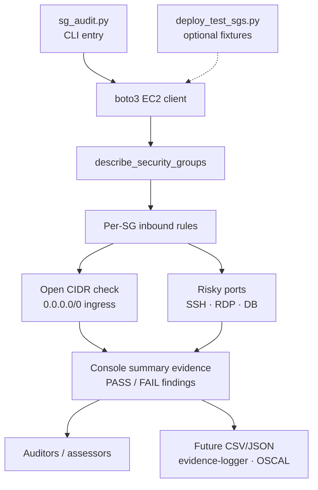

# Security Group Audit

I wrote this to walk an AWS account's EC2 security groups and print which inbound
rules still open to `0.0.0.0/0`, with a harder FAIL when that open range hits a
management or database port. Six ports are treated as critical today: 22, 3389,
3306, 5432, 1433, 27017. Everything else open to the internet is a WARN, because
a public 443 on a web tier is often intentional.

It does not look at egress. It does not check IPv6 `::/0`. Output is console text
only; CSV and JSON are still on the list below.

## Compliance Controls Addressed

| NIST 800-53 Rev 5 | FedRAMP High | CJIS v6.0 | Validation Method |
|--------------------|:------------:|:---------:|-------------------|
| SC-7 Boundary Protection | Yes | Policy Area 13 | Detects `0.0.0.0/0` ingress on any inbound rule |
| SC-7(3) Access Points | Yes | - | Limits attack surface by enumerating risky ports |
| SC-7(4) External Telecommunications Services | Yes | - | Enforces cloud network boundary at security-group layer |
| AC-3 Access Enforcement | Yes | - | Network-layer access control at the SG |
| AC-4 Information Flow Enforcement | Yes | - | Ingress flow control (egress on roadmap) |
| CM-7 Least Functionality | Yes | - | Flags risky management ports (SSH, RDP, DB ports) |
| AU-12 Audit Record Generation | Yes | - | Every audit run produces compliance evidence |

## Overview

Two scripts:

1. **`sg_audit.py`** - Audits security groups for open internet access and risky ports.
2. **`deploy_test_sgs.py`** - Creates test security groups with various configurations to exercise the audit script.

## Architecture Overview



Editable Mermaid source (kept in sync with the fence above): [`docs/architecture.mmd`](docs/architecture.mmd).

`sg_audit.py` calls `describe_security_groups`, walks each inbound permission, and
flags `0.0.0.0/0` with FAIL or WARN depending on the port. `deploy_test_sgs.py`
builds four fixture groups so you can see both severities without hunting a live
misconfiguration.

## Requirements

- Python 3.x
- `boto3` library
- AWS CLI configured with credentials (`aws configure`)

### Install dependencies

```bash
pip install boto3
```

## Usage

### Run the audit

```bash
python sg_audit.py
```

**Sample output:**

```
Checking: test-open-ssh (sg-07c07ec3b75a2aa62)
    [FAIL] Port 22 is open to the Internet!

Checking: test-open-rdp (sg-01d01d1b156373a84)
    [FAIL] Port 3389 is open to the Internet!

Checking: test-secure (sg-0f8c1c9faa58e4c1d)

Checking: default (sg-0ecc91801d95742d6)

Checking: test-open-https (sg-02e918fc9b1fa60f1)
    [WARN] Open to internet on port 443.

========================================
Total security groups: 5
Groups with open rules: 3
Critical findings (risky ports): 2
```

### Deploy test security groups (optional)

```bash
python deploy_test_sgs.py
```

Creates 4 security groups with different configurations:

| Security Group | Rule | Expected Result |
|----------------|------|-----------------|
| `test-open-ssh` | Port 22 → 0.0.0.0/0 | FAIL |
| `test-open-rdp` | Port 3389 → 0.0.0.0/0 | FAIL |
| `test-open-https` | Port 443 → 0.0.0.0/0 | WARN |
| `test-secure` | No rules | Clean |

## Compliance Checks

### 1. Open to Internet (SC-7, AC-3, AC-4)

Checks if any inbound rule allows traffic from `0.0.0.0/0`. Open ingress on any port is a boundary protection finding under SC-7; non-risky ports drop to `WARN` because some workloads (e.g., public-facing web servers on 443) legitimately require it, while risky ports stay `FAIL`.

### 2. Risky Ports (CM-7, SC-7(3))

Flags critical findings if these management / database ports are open to the internet:

| Port | Service |
|------|---------|
| 22 | SSH |
| 3389 | RDP |
| 3306 | MySQL |
| 5432 | PostgreSQL |
| 1433 | MSSQL |
| 27017 | MongoDB |

## Output Legend

| Status | Meaning |
|--------|---------|
| `[FAIL]` | Risky port open to internet |
| `[WARN]` | Non-risky port open to internet |
| (no output) | No open rules |

## How an Auditor Uses This Output

I run this against the in-scope account before an SC-7 walkthrough and keep the
console summary as the working list. Each FAIL is a concrete group ID, port, and
open CIDR the assessor can ask the system owner to justify or close. WARNs stay
on the list because "we meant to expose 443" still needs a sentence in the
narrative. Pair it with `cloudtrail-audit` if you also need who changed the group,
and with `evidence-logger` if you want a timestamped file instead of a scrollback
buffer.

## FedRAMP 20x Alignment

Today the script prints text. That is enough to re-run the same check on a fixed
schedule and compare counts run to run. I have not wired OSCAL Assessment Results
or a KSI feed yet; the path I want is JSON findings that
[`oscal-evidence-pipeline`](https://github.com/0xBahalaNa/oscal-evidence-pipeline)
can ingest without a hand rewrite. Until that lands, this is a repeatable boundary
check, not a continuous-monitoring metric source.

## CJIS v6.0 Relevance

CJIS Security Policy v6.0 (Dec 27, 2024) maps SC-7 into Policy Area 13. Default
audit baseline from April 1, 2026; Priority 2-4 fully enforceable Oct 1, 2027
(timing varies by state CSA). On a CJI network, any `0.0.0.0/0` inbound rule is
the kind of finding that shows up early in a boundary review. I still treat
non-risky open ports as WARN in the default mode. A planned `--cjis-mode` flag
would force FAIL on every open-internet ingress when the group is attached to a
CJI-tagged ENI.

## Roadmap

Consolidation target is the Unified Evidence Collector (Project 4), alongside
`s3-audit`, `cloudtrail-audit`, and `evidence-logger`. Before that merge I want
`--cjis-mode`, egress coverage for AC-4, IPv6 `::/0` checks, and JSON export into
[`oscal-evidence-pipeline`](https://github.com/0xBahalaNa/oscal-evidence-pipeline).

## Cleanup

Delete test security groups when done:

```bash
aws ec2 delete-security-group --group-name test-open-ssh
aws ec2 delete-security-group --group-name test-open-rdp
aws ec2 delete-security-group --group-name test-open-https
aws ec2 delete-security-group --group-name test-secure
```

## Future Enhancements

- Export results to CSV / JSON for downstream OSCAL pipelines
- Check IPv6 ranges (`::/0`)
- Audit egress (outbound) rules for AC-4 information flow
- Filter by VPC or tags (in-scope CJI vs general-purpose)
- `--cjis-mode` flag for stricter findings on CJI-tagged resources
- Auto-remediation hooks (revoke risky ingress)
- SNS / email alerts for findings

## Framework Reference

Control family mappings and AWS implementation details are documented in [nist-800-53-rev-5-to-aws-mapping](https://github.com/0xBahalaNa/nist-800-53-rev-5-to-aws-mapping).

## License

MIT
